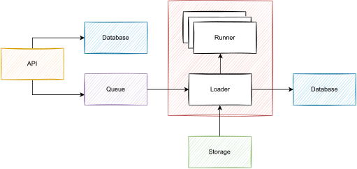

# CARS 

![License][license-badge]
![Build][build-badge]

Cars is an **Compile And Run Sandbox**.

  

[license-badge]: https://img.shields.io/github/license/ajeetdsouza/zoxide?color=lightgray
[build-badge]: https://github.com/stephensli/cars/actions/workflows/go.yml/badge.svg?branch=main
