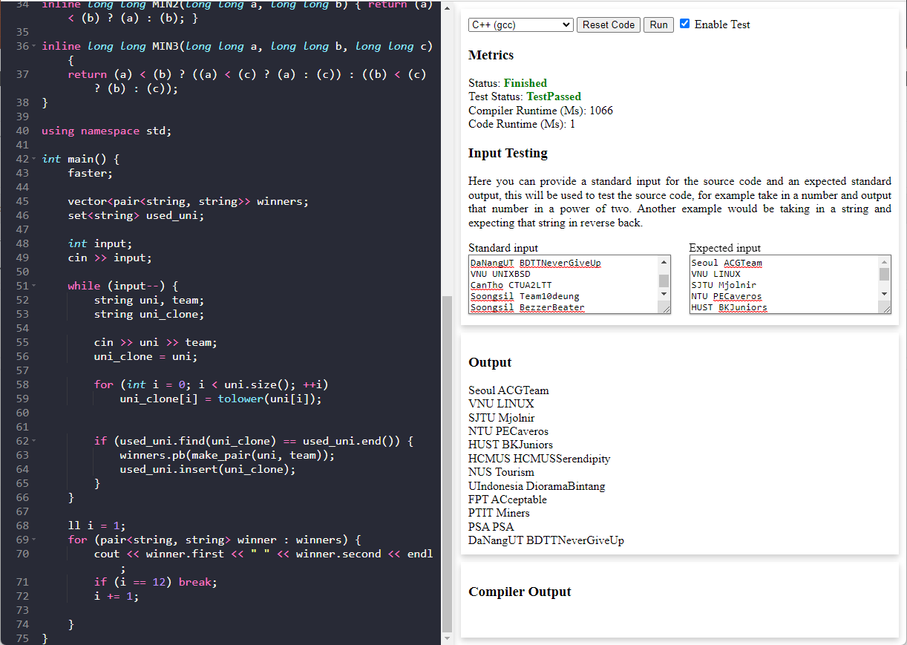

Below includes the documentation of the existing API sample site which can be used to sample CARS.

- [Overview](#overview)
	* [Accessing the site](#accessing-the-site)
	* [Source code of the site](#source-code-of-the-site)

# Overview

The sample site will allow you to test all the core functionality of what the API exposes via the rest endpoint. This site
allows switching between all the currently supported languages (exposed via the languages' endpoint), modifying the
source code to provide any content you wish, related test input and expected output for user input testing, and finally
running.

The execution will display near real-time processing via the usage of the compile information endpoint. The result will
finally be written into the metrics field, output, and compiler output fields. The sample site will additionally cache
any code changes you make per language with the support of resetting these.

## Accessing the site

Access to the sample site can be done via the root of the API, which can only be executed when running the service
in the development environment (default). This means by default running locally you can access the site via 
`http://localhost:8080`.

## Source code of the site 

To understand the implementation and how the sample site works you can view the source for the site within the folder
`assets/sample-site` which contains the main API communication implementation within `index.js`.
